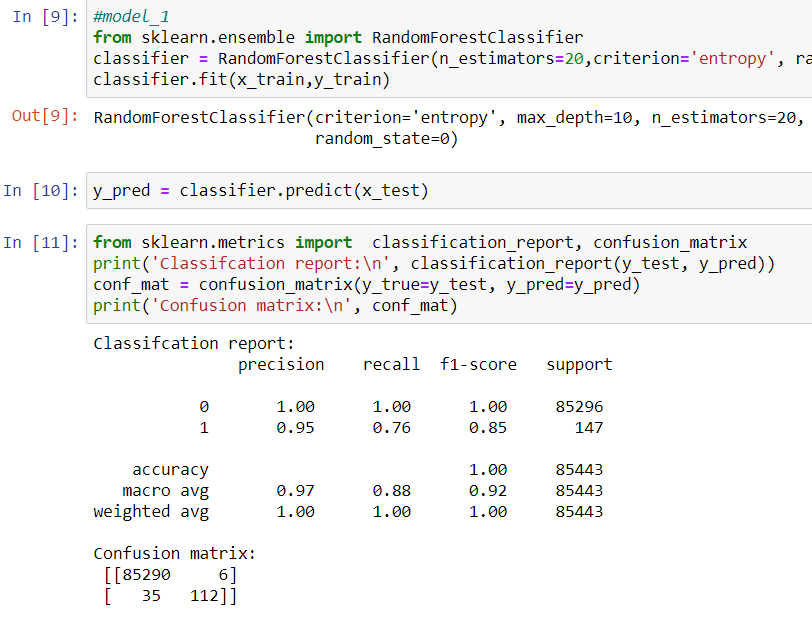
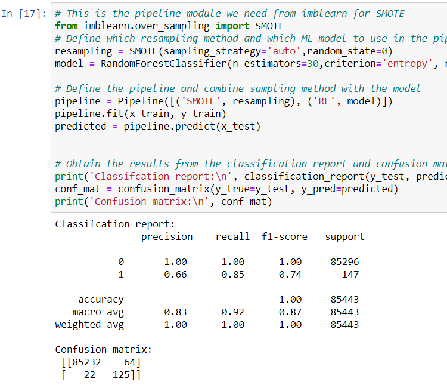
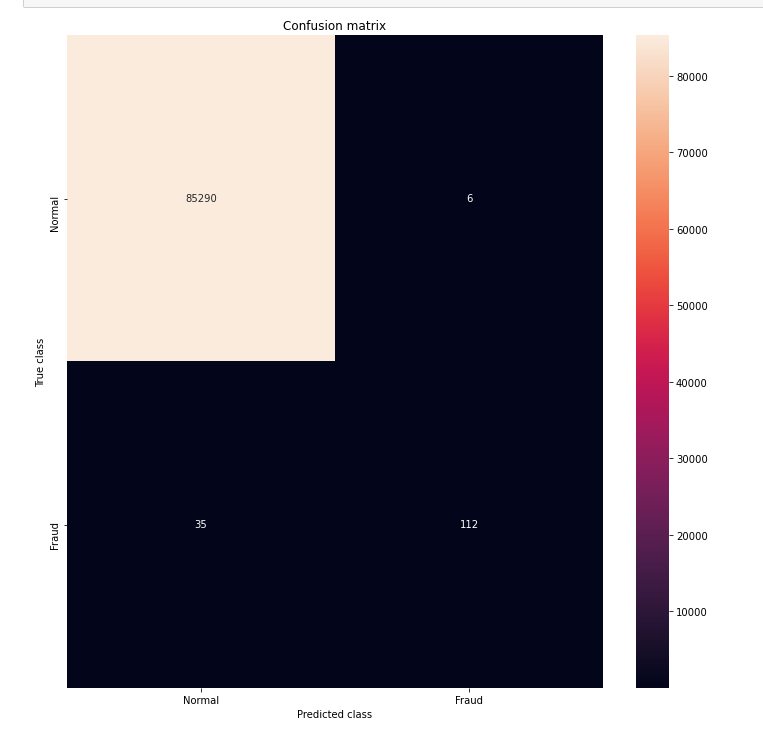

# Credit-Card-Fraud-Detection-using-Random-Forest
A machine learning model to detect fraud in credit card customers using Random Forest Classification Algorithm.  

The dataset can be found at : https://www.kaggle.com/mlg-ulb/creditcardfraud  

we are applying random forest algorithm for classification of the credit card dataset. Random Forest is an algorithm for classification and regression. Summarily, it is a collection of decision tree classifiers. Random forest has advantage over decision tree as it corrects the habit of over fitting to their training set. A subset of the training set is sampled randomly so that to train each individual tree and then a decision tree is built, each node then splits on a feature selected from a random subset of the full feature set. Even for large data sets with many features and data instances training is extremely fast in random forest and because each tree is trained independently of the others. The Random Forest algorithm
has been found to provide a good estimate of the generalization error and to be resistant to over fitting.  

The output looks like :  

